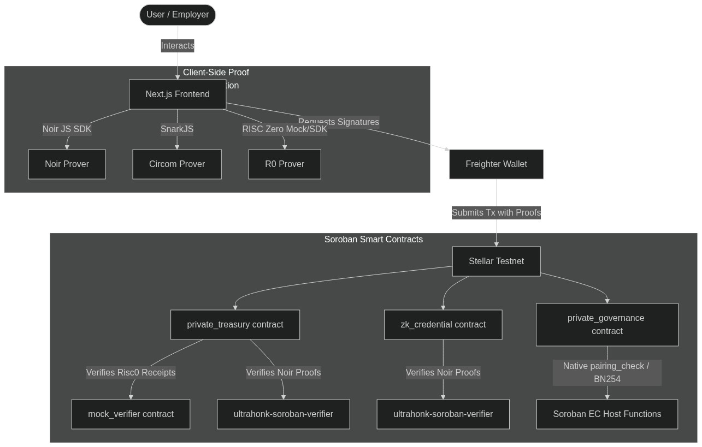
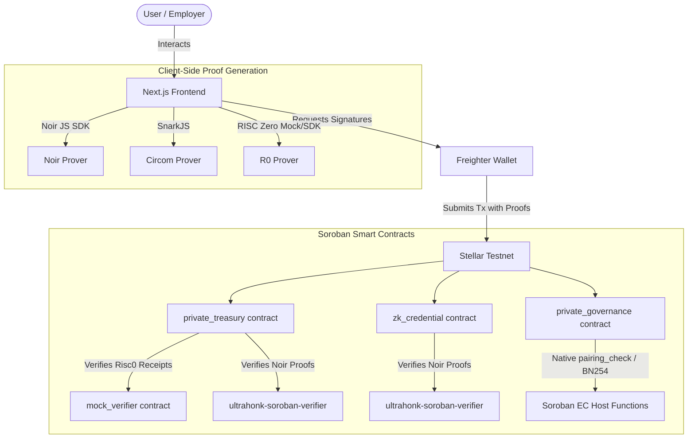
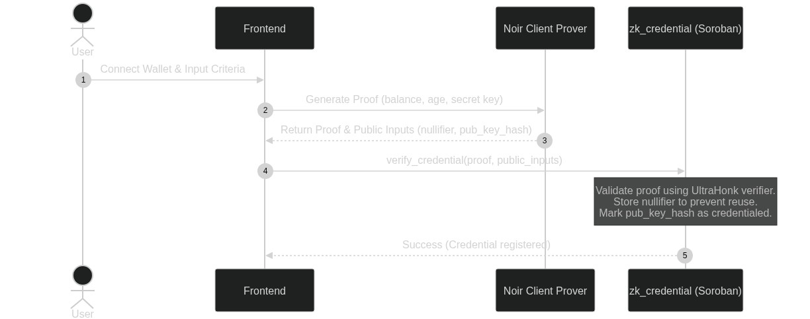
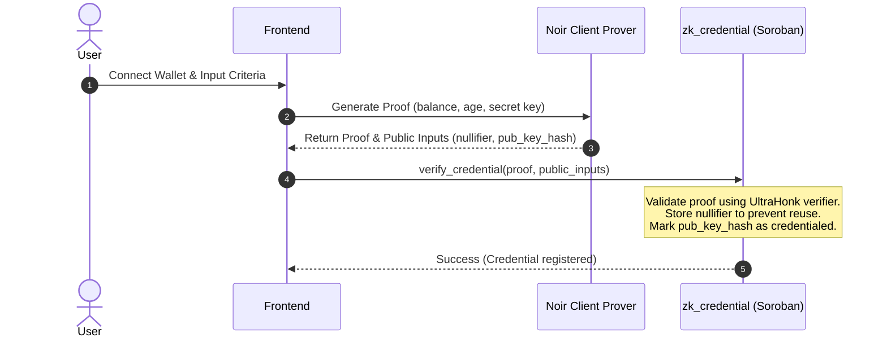
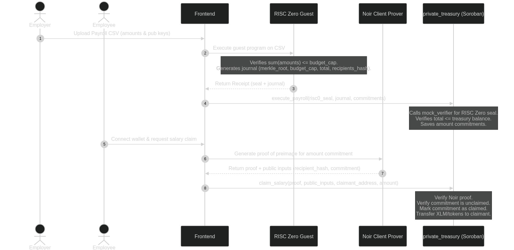
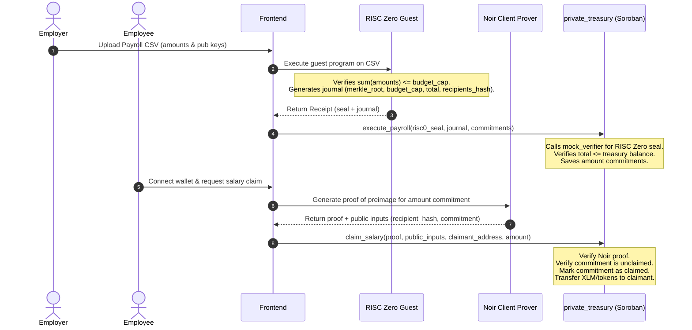
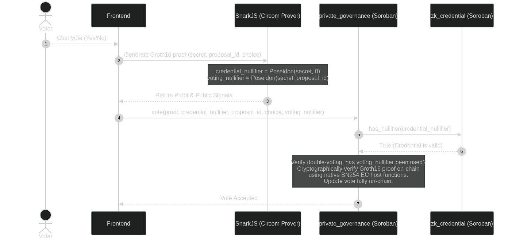
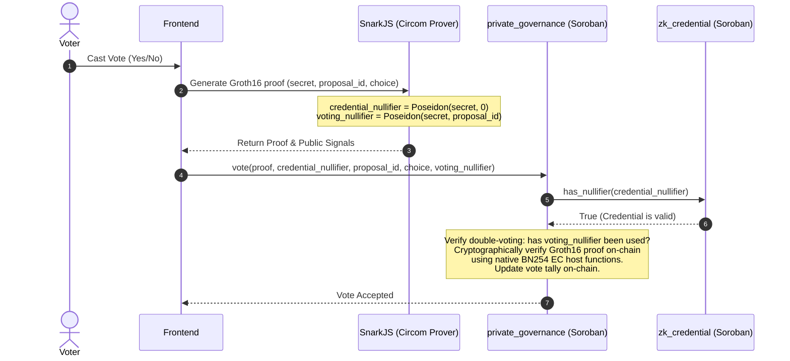

# Obscura — Payroll · Voting · Credentials · Treasury · Compliance

**Real-World ZK Hackathon Submission**

A privacy-preserving finance and governance platform on Stellar. By combining zero-knowledge credentials, confidential payroll, and private DAO governance, Obscura enables organizations to execute compliant on-chain workflows without exposing sensitive financial or identity details. All proofs are verified on-chain via Soroban smart contracts.

---

## 🎯 Project Overview

Obscura is built to bridge the gap between powerful cryptographic building blocks and production-ready applications. It integrates all three major zero-knowledge proof ecosystems supported on Stellar:

1. **Noir**: Used for client-side zero-knowledge credential generation and private salary claims.
2. **RISC Zero**: Used for verifiable batch computation off-chain (validating csv payroll records against a budget cap and credential allowlist).
3. **Circom (Groth16)**: Used for private sealed-bid voting, verified directly in a Soroban contract using the native BN254 elliptic-curve host functions.

---

## 🏗️ General System Architecture

The following diagram illustrates how the frontend, Freighter wallet, Soroban contracts, and various ZK verifiers interact:





---

## 🚀 How It Works — 3 Core Flows

### Flow 1 — ZK Credentials & Identity (Noir)

Allows a user to prove they meet eligibility requirements (e.g., age or minimum balance) without revealing their actual balance, age, or identity.





- **Circuit**: [circuits/credential](file:///home/lviffy/Projects/Stellar-ZK/circuits/credential) (Noir)
- **Contract**: [contracts/zk_credential](file:///home/lviffy/Projects/Stellar-ZK/contracts/zk_credential) (Soroban + `ultrahonk-soroban-verifier`)

### Flow 2 — Shielded Payroll (RISC Zero + Noir)

Allows employers to process a batch payroll CSV off-chain, prove compliance with budget limits and credentials on-chain, and allows employees to claim their salaries privately.





- **Circuit (Batch)**: [circuits/payroll_guest](file:///home/lviffy/Projects/Stellar-ZK/circuits/payroll_guest) (RISC Zero Guest program)
- **Circuit (Claim)**: [circuits/payroll](file:///home/lviffy/Projects/Stellar-ZK/circuits/payroll) (Noir)
- **Contract**: [contracts/private_treasury](file:///home/lviffy/Projects/Stellar-ZK/contracts/private_treasury) (Soroban)

### Flow 3 — Private DAO Voting (Circom Groth16)

Enables voters to cast private, double-vote resistant ballots. Voters prove they possess a valid credential nullifier from Flow 1, and cast their choice (0/1) without exposing which option they voted for or who they are.





- **Circuit**: [circuits/circom/voting](file:///home/lviffy/Projects/Stellar-ZK/circuits/circom/voting) (Circom 2.0 + Poseidon hasher)
- **Contract**: [contracts/private_governance](file:///home/lviffy/Projects/Stellar-ZK/contracts/private_governance) (Soroban using native `crypto::bn254` host functions)

---

## 📁 Repository Structure

The actual project architecture is laid out as follows:

```text
stellar-zk/
├── Cargo.toml                  # Workspace configuration for contracts
├── scripts/                    # Deploy and setup scripts
│   ├── deploy.sh               # Compiles and deploys all contracts & mock verifier
│   └── deploy_zk_credential.sh # Deploys only the credential contract
├── contracts/                  # Soroban smart contracts (Rust)
│   ├── zk_credential/          # Noir UltraHonk credential verifier & registry
│   ├── private_treasury/       # Payroll contract handling R0 receipts & Noir claims
│   └── private_governance/     # Groth16 private voting using native BN254 host functions
├── circuits/                   # ZK Circuits
│   ├── credential/             # Noir circuit for proving user criteria eligibility
│   ├── payroll/                # Noir circuit for proving salary claim preimages
│   ├── payroll_guest/          # RISC Zero guest code verifying batch CSV payroll
│   ├── circom/voting/          # Circom PrivateVoting circuit & pre-computed ZKeys
│   └── lib/                    # Shared ZK libraries
├── frontend/                   # Next.js frontend application
│   ├── src/                    # App components, pages, hooks
│   │   └── lib/contracts.ts    # Deployed contract addresses & RPC config
│   └── package.json
└── lib/
    └── stellar-risc0-verifier/ # Nethermind's RISC Zero verifier & Mock Verifier
```

---

## 🛠️ Tech Stack & Primitives

- **Blockchain Engine**: Stellar Soroban (Protocol 25/26 features)
- **ZK Verifiers**:
  - **UltraHonk**: Leveraged by Noir. Verification is performed inside [zk_credential](file:///home/lviffy/Projects/Stellar-ZK/contracts/zk_credential) using the `ultrahonk-soroban-verifier` library crate.
  - **Groth16 (BN254)**: Used by Circom. Verification is directly implemented inside [private_governance](file:///home/lviffy/Projects/Stellar-ZK/contracts/private_governance) using native Soroban BN254 EC pairing functions (`pairing_check`, `g1_mul`, `g1_add`), bypassing external dependency overhead and reducing verification gas costs.
  - **RISC Zero**: Verified using Nethermind's `mock-verifier` for development/testing, verifying guest journals on-chain.
- **Frontend Stack**: Next.js 16, React 19, TypeScript, SnarkJS (client-side Groth16), `@stellar/stellar-sdk`, `@stellar/freighter-api`.

---

## ⚠️ Current Status & Mock Details

- **Client-Side Simulation**: RISC Zero proofs are heavy to generate in browser environments. The frontend simulates the execution of the RISC Zero guest program to generate the journal.
- **On-chain Mock Verifier**: To allow testnet demonstration without high local hardware or Bonsai API dependencies, we deploy the `mock-verifier` contract from Nethermind's repository. The verifier validates the mock seals submitted by the frontend.
- **Noir Verification**: Full UltraHonk verification is active. To facilitate rapid frontend testing, a mock bypass header (`0xaaaa`) is supported in `zk_credential` to easily run checks without executing full proof-generation delays when desired.

---

## 🚀 Setup & Local Running Guide

### 1. Prerequisites

Ensure you have the following installed:
- [Rust](https://www.rust-lang.org/tools/install) (target `wasm32-unknown-unknown` and cargo-generate)
- [Stellar CLI](https://developers.stellar.org/docs/build/smart-contracts/getting-started/setup#install-the-stellar-cli) (v22.0.0+)
- [Node.js](https://nodejs.org/) (v18+)
- [Noir / Nargo](https://noir-lang.org/docs/getting_started/installation/)

### 2. Compile Circuits

#### Noir Circuits (Credential & Payroll Claim)
```bash
# Proving key setup & compile
cd circuits/credential
nargo compile

cd ../payroll
nargo compile
```

#### Circom Voting Circuit
The voting circuit artifacts (`voting_final.zkey`, `verification_key.json`, etc.) are pre-generated inside `circuits/circom/voting` for ease of setup. To verify or inspect:
```bash
cd circuits/circom/voting
# View voting.circom
cat voting.circom
```

### 3. Build & Deploy Contracts

To compile the smart contracts (including the Nethermind mock verifier) and deploy them to Stellar Testnet, run:

```bash
# 1. Set your deployer secret in environment
export DEPLOYER_SECRET="SA..."

# 2. Run the deployment script
bash scripts/deploy.sh
```

The script will:
- Fund your deployer account on Testnet via Friendbot.
- Build all smart contracts to WASM target `wasm32v1-none`.
- Deploy `zk_credential`, `mock_verifier`, `private_governance`, and `private_treasury` contracts.
- Auto-generate the configuration in `frontend/src/lib/contracts.ts` and `frontend/.env.local`.

### 4. Run the Frontend

```bash
cd frontend
npm install
npm run dev
```

Visit `http://localhost:3000` to interact with Obscura.

---

## 📹 Video Walkthrough & Live Demo

- **Live App Demo**: [Link to deployed application on Vercel/Netlify]
- **Walkthrough Video**: [Link to 2-3 minute YouTube or Loom video showing the load-bearing ZK components in action]

---

## 📜 License

This project is licensed under the MIT License.